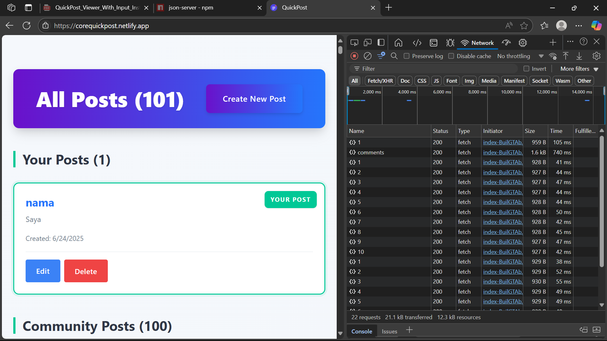
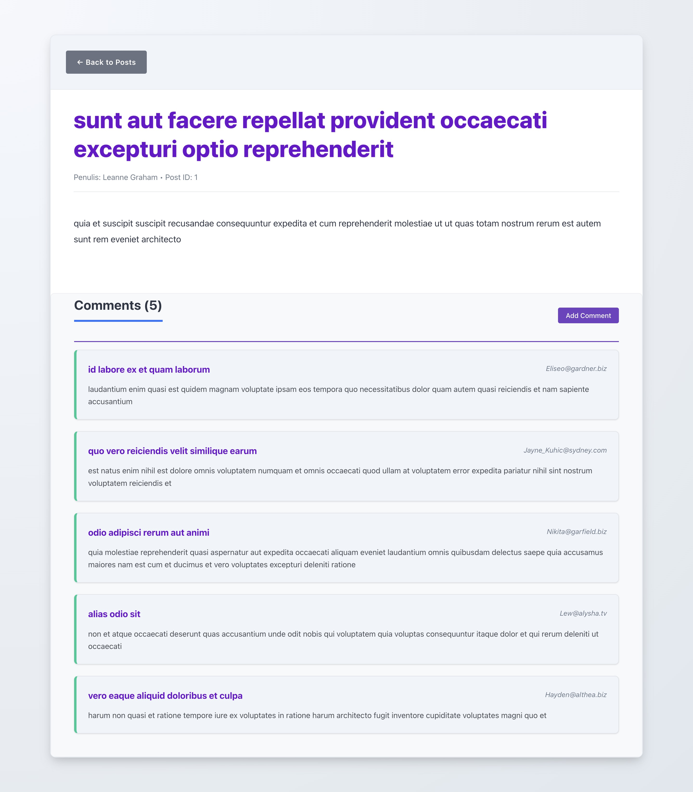
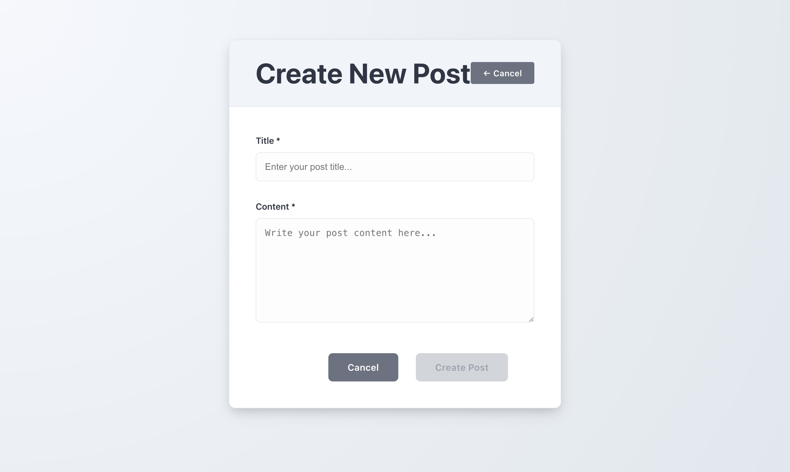
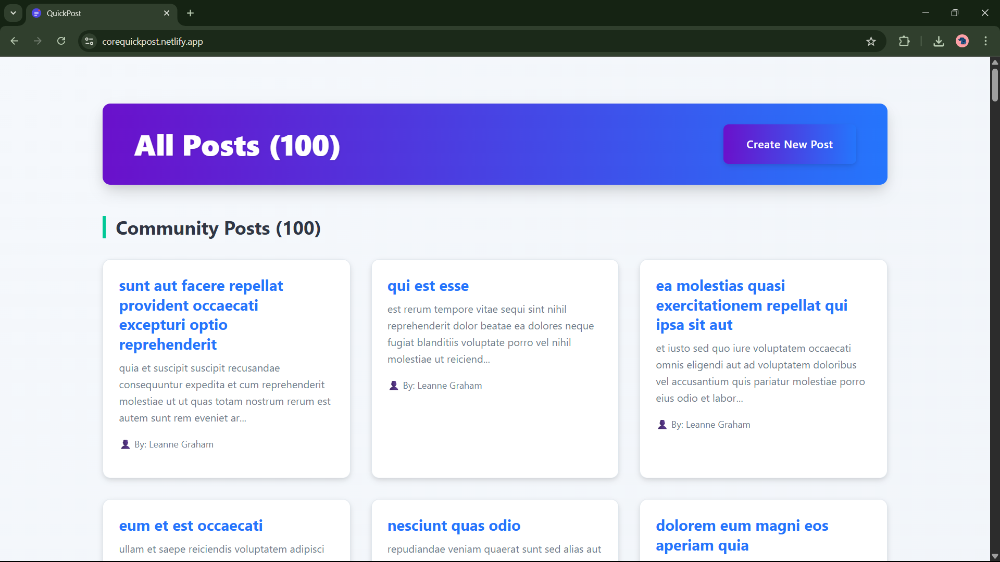

# CORE GROUP 4 QUICKPOST

# 📝 CoreQuickPost

**CoreQuickPost** adalah aplikasi web sederhana berbasis CRUD (Create, Read, Update, Delete) yang memungkinkan pengguna untuk melihat, membuat, dan membaca postingan. Dibangun dengan teknologi modern dan di-host secara live menggunakan Netlify.

## 🔗 Live Demo

🌐 [https://corequickpost.netlify.app](https://corequickpost.netlify.app)

## 🚀 Fitur Utama

- 🔄 Menampilkan daftar semua post dari API
- 🔍 Melihat detail dari setiap post
- ➕ Membuat post baru melalui form
- ☁️ Live deployment di Netlify

## 🖼️ Screenshots

| Fitur | Cuplikan |
|-------|----------|
| Post List Page |  |
| Post Detail Page |  |
| Create Post Form |  |
| Netlify Live Site |  |

## 🛠️ Teknologi yang Digunakan

- React.js (Frontend Framework)
- Axios atau Fetch API untuk komunikasi dengan backend
- JSON Server / REST API (simulasi backend)
- React Router untuk navigasi
- Netlify (Deployment)

